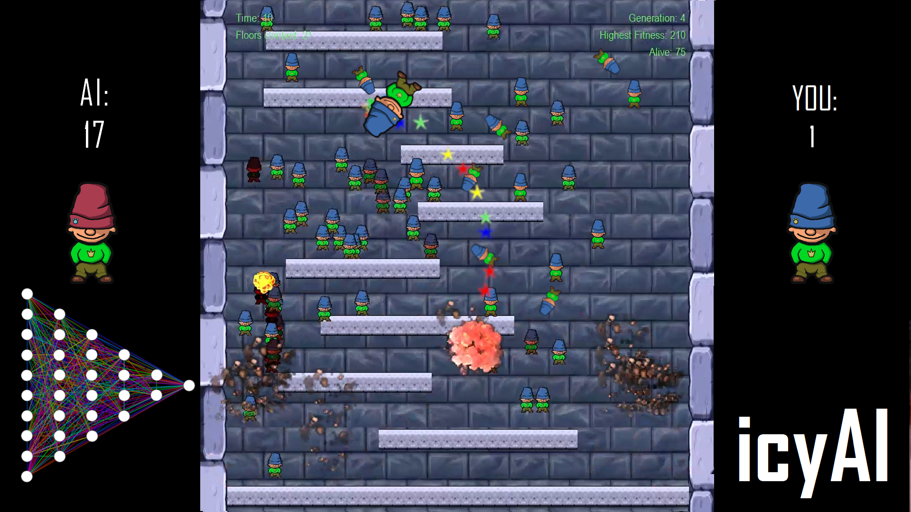

👋 Hi, I’m @nikp06 - a Freelance Machine Learning Engineer based in Cologne, Germany! Also check out my [Website](https://nikpetersen.com) or my [YouTube](https://www.youtube.com/channel/UCV3IJuY11hfmjDomu6rEWTg).

Here are some of my YouTube-Videos from a time where i was especially interested in making AI's learn how to play video games:
Subway Surfers            |  Icy Tower
:-------------------------:|:-------------------------:
  |  

<!---
nikp06/nikp06 is a ✨ special ✨ repository because its `README.md` (this file) appears on your GitHub profile.
You can click the Preview link to take a look at your changes.
--->

